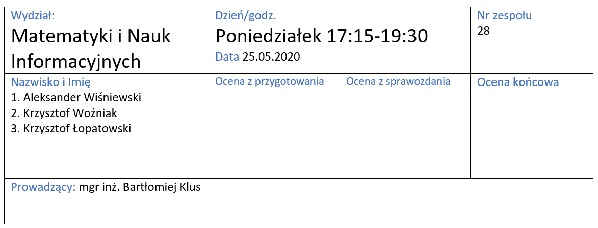
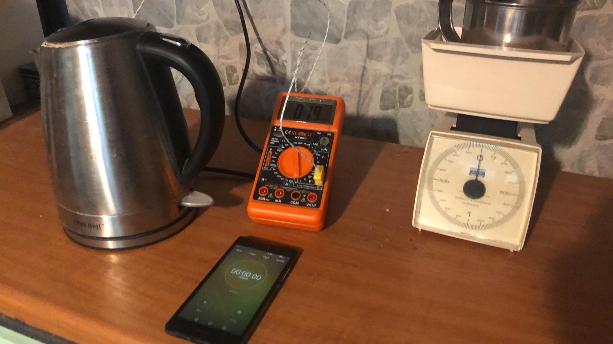

```{r setup, include=FALSE}
knitr::opts_chunk$set(echo = FALSE)
library(readxl)
library(ggplot2)
library(knitr)
library(kableExtra)
source('Lab3_zad3_derivs.R')
source('Lab3_zad2_derivs.R')
source('Lab3_zad1_derivs.R')
options(OutDec= ",", scipen = 999)
```

```{r, echo = FALSE}
a <- "c_{wH_2O}"
b <- "m_k"
c <- "m_{2H_2O}"
d <- "T_{2H_2O}"
e <- "T_{1H_2O}"
f <- "T_k"
g <- "m_{1H_2O}"
ck <- "c_k"
```



# Wyznaczenie ciepła właściwego wody

## Cel

Celem eksperymentu jest wyznaczenie wartości ciepła właściwego wody w warunkach domowych.

## Opis eksperymentu

Ciepło właściwe to stosunek energii potrzebnej do zmiany temperatury ciała o masie 1kg o jeden Kelwin.
Do obliczenia ciepła właściwego wykorzystuje się następujący wzór:
$$
c_w = \frac{Q}{m * \Delta T},
$$
gdzie Q to ilość dostarczonej energii, m to masa ciała, $\Delta T$ to różnica temperatur.
Do wyznaczenia dostarczonej energii wykorzystano wzór:
$$
Q = P \cdot \Delta t,
$$
gdzie P to moc grzałki, a $\Delta t$ to czas ogrzewania.


Ostateczny wzór użyty do wyznaczenia wartośći ciepła właściwego
$$
c_{H_2O} = \frac{P * \Delta t}{m *  \Delta T}
$$


## Założenia

Dla uproszczenia obliczen założono szczelność układu.

## Układ eksperymentalny



Pomiary wykonywane były przy użyciu:

\begin{itemize}
  \item termometru bimetalowego o zakresie -40+1000°C, z dokładnością ±0.75%±3 cyfry i rozdzielczość 1°C
  \item wagi kuchennej analogowej, sprężynowej, o dokładności 10g
  \item czajnika elektrycznego o mocy znamionowej 1850-2200W
  \item dwóch telefonów komórkowych z funkcją stopera
\end{itemize}

Czas reakcji eksperymentatora obliczono na około 160ms za pomocą eksperymentu z włączeniem i wyłączeniem stopera.
Odczytu temperatury dokonywany niezwłocznie po wyświetleniu przez miernik liczby większej lub równej 100. Woda używana do eksperymentu pochodziła z instalacji domowej.


## Dane eksperymentalne

```{r echo = FALSE}
pom1 <- as.data.frame(read_excel(path = "zad1.xlsx"))
power <- 1850
cww <- power * pom1$t / (pom1$m * (pom1$Tk - pom1$Tp))
pom1 <- cbind(pom1, deltaT = pom1$Tk - pom1$Tp, cww = cww)
pom1 <- pom1[, c(1, 2, 3, 5, 4, 6)]

kable(pom1, caption="Zestawienie wyników pomiarów i wyznaczonego ciepła właściwego wody", format = "latex", escape = FALSE, align = 'c', col.names = c("$m [kg]$", "$T_p [\\degree C]$", "$T_{k} [\\degree C]$", "$\\Delta T [\\degree C]$", "$\\Delta t [s]$",  "$c_{wH_2O} [\\frac{J}{kg * K}]$")) %>%
   kable_styling(position="center", latex_options = c("striped", "HOLD_position"))
```

\newpage

## Analiza niepewności

Wszystkie pomiary obarczone są niepewnością typu B. Niepewność wyznaczonej wartości obliczono z prawa propagacji niepewności.

$$
u_B(c_{H_2O}) = \sqrt{
(\frac{\partial c}{\partial P})^2 * u^2_B(P) + 
(\frac{\partial c}{\partial \Delta t})^2 * u^2_B(\Delta t) +
(\frac{\partial c}{\partial m})^2 * u^2_B(m) +
(\frac{\partial c}{\partial \Delta T})^2 * u^2_B(\Delta T)
} 
$$
$$
\frac{\partial c}{\partial P} = \frac{\Delta t}{m * \Delta T} 
$$
$$
\frac{\partial c}{\partial \Delta t} = \frac{P}{m*\Delta T}
$$
$$
\frac{\partial c}{\partial m} = -\frac{P*\Delta t}{m^2 \Delta T}
$$
$$
\frac{\partial c}{\partial \Delta T} = -\frac{P*\Delta t}{m \Delta T ^2}
$$

Przyjęto następujące wartości niepewności typu B: $u_B(P) = \frac{350}{\sqrt{3}}, u_B(m) = \frac{0,06}{\sqrt{3}}, u_B(\Delta T) = \frac{2}{\sqrt{3}}, u_B(\Delta t) = \frac{0,21}{\sqrt{3}}$.

```{r echo = FALSE}
niepP <- 350 / sqrt(3)
niepm <- 0.06 / sqrt(3)
niept <- 0.21 / sqrt(3)
niepT <- 2 / sqrt(3)

warPd <- z1Pd(t = pom1$t, m = pom1$m, T = pom1$deltaT, P = power)  
wartd <- z1td(t = pom1$t, m = pom1$m, T = pom1$deltaT, P = power) 
warTd <- z1Td(t = pom1$t, m = pom1$m, T = pom1$deltaT, P = power) 
warmd <- z1md(t = pom1$t, m = pom1$m, T = pom1$deltaT, P = power) 

totalNiep <- sqrt(niepP^2 * warPd^2 + 
                    niepm^2 * warmd^2 + 
                    niept^2 * wartd^2 + 
                    niepT^2 * warTd^2)
pom1 <- cbind(pom1, niep = totalNiep)

kable(pom1, caption="Zestawienie wyników pomiarów i wyznaczonego ciepła właściwego wody z niepewnościami", format = "latex", escape = FALSE, align = 'c', col.names = c("$m [kg]$", "$T_p [\\degree C]$", "$T_{k} [\\degree C]$", "$\\Delta T [\\degree C]$", "$\\Delta t [s]$",  "$c_{wH_2O} [\\frac{J}{kg * K}]$", "$u_B(c_{H_2O}) [\\frac{J}{kg * K}]$")) %>%
   kable_styling(position="center", latex_options = c("striped", "HOLD_position"))

```


## Wnioski

Wartośc tablicowa ciepła właściwego wody wynosi około $4183 \frac{J}{kg \cdot K}$. 
Wartość ta nie znajduje się w przedziałach niepewności wyników, co świadczy o grubym błędzie pomiarów.
Wynikać to może z przyjętych założeń lub wad sprzętu. Z powodu wyniku znacznie odbiegającego od wartości tablicowej w kolejnych częściach zadania do obliczeń wykorzystano wartość tablicową.


\newpage


# Wyznaczenie ciepła właściwego kalorymetru

## Cel

Celem drugiego zadania jest wyznaczenie ciepła właściwego kalorymetru. 

## Opis eksperymentu

W chwili początkowej kalorymetr o masie $`r b`$ wypełniony był wodą o masie $`r g`$. Wewnątrz kalorymetru panował stan równowagi termodynamicznej, czyli temperatura kalorymetru była równa temperaturze wody i wynosiła $`r e`$. Dolanie do kalorymetru wody o masie $`r c`$ i temperaturze $`r d`$ > $`r e`$ spowodowało oddanie części energii dolanej wody do kalorymetru i wody wcześniej się w nim znajdującej, ponieważ temperatura dolewanej wody była większa niż temperatura układu. Po pewnym czasie układ osiągnął stan równowagi termodynamicznej - temperatura wymieszanej wody oraz kalorymetru była taka sama i równa $`r f`$. Bilans energetyczny opisujący takie zdarzenie jest następujący:

$$`r c` `r a`(`r d` - `r f`) = `r g``r a`(`r f` - `r e`) + `r b`c_{wk}(`r f` - `r e`)$$
Lewa strona równania opisuje energię oddaną przez dolaną wodę, natomiast prawa strona energię otrzymaną przez kalorymetr oraz wodę, która się w nim znajdowała. Po przeniesieniu pierwszego składnika prawej strony na lewą oraz podzieleniu równania przez $`r b`(`r f` - `r e`)$ otrzymano wzór na ciepło właściwe kalorymetru:

$$c_k = \frac{`r a`}{`r b`}(`r c`\frac{`r d` - `r f`}{`r f` - `r e`} - `r g`)$$

## Dane eksperymentalne

```{r, echo = FALSE}
pomiary <- as.data.frame(read_excel(path = "pomiary_wozniak.xlsx", sheet = 'zad2'))
pomiaryalek <- as.data.frame(read_excel(path = "kalorymetr_Alek.xlsx"))[, 3:7]
pomiarylopat <- as.data.frame(read_excel(path = "kalorymetr_lopatowski.xlsx"))[, 3:7]

cww <- 4183
mk <- 0.765

pom_tab <- rbind(pomiary[, c(-1, -2, -8)], pomiaryalek, pomiarylopat)


cwk <- cww/mk * (pom_tab[, 3] * 
            (pom_tab[, 4] - pom_tab[, 5]) / 
            (pom_tab[, 5] - pom_tab[, 2]) - 
            pom_tab[, 1])
a <- cww
b <- mk 
c <- pom_tab[, 3]
d <- pom_tab[, 4]
e <- pom_tab[, 2]
f <- pom_tab[, 5]
g <- pom_tab[, 1]
pom_tab <- cbind(pom_tab, cwk)
kable(pom_tab[1:5, ], caption="Seria 1", format = "latex", escape = FALSE, align = 'c', col.names = c("$m_{1H_2O} [kg]$", "$T_{1H_2O} [\\degree C]$", "$m_{2H_2O} [kg]$", "$T_{2H_2O} [\\degree C]$", "$T_{k} [\\degree C]$", "$c_{wk}[\\frac{J}{kg \\cdot K}] $")) %>%
   kable_styling(position="center", latex_options = c("striped", "HOLD_position"))

pom2 <- pom_tab[6:10, ]
rownames(pom2) <- NULL
kable(pom2, caption="Seria 2", format = "latex", escape = FALSE, align = 'c', col.names = c("$m_{1H_2O} [kg]$", "$T_{1H_2O} [\\degree C]$", "$m_{2H_2O} [kg]$", "$T_{2H_2O} [\\degree C]$", "$T_{k} [\\degree C]$", "$c_{wk}[\\frac{J}{kg \\cdot K}] $")) %>%
   kable_styling(position="center", latex_options = c("striped", "HOLD_position"))

pom3 <- pom_tab[11:15, ]
rownames(pom3) <- NULL
kable(pom3, caption="Seria 3", format = "latex", escape = FALSE, align = 'c', col.names = c("$m_{1H_2O} [kg]$", "$T_{1H_2O} [\\degree C]$", "$m_{2H_2O} [kg]$", "$T_{2H_2O} [\\degree C]$", "$T_{k} [\\degree C]$", "$c_{wk}[\\frac{J}{kg \\cdot K}] $")) %>%
   kable_styling(position="center", latex_options = c("striped", "HOLD_position"))
```

Pierwsze pięć kolumn przedstawia dane zmierzone podczas eksperymentu. W ostatniej kolumnie zawarto obliczoną wartość ciepła właściwego kalorymetru. Masa kalorymetru wynosi $m_k = 0,765 kg$, a za ciepło właściwe wody jako wartość nieobarczoną błędem przyjęto 4183 $\frac{J}{kg \cdot K}$.

## Analiza niepewności pomiarowych

Wszystkie pomiary obarczone są niepewnością pomiarową typu B. Aby wyznaczyć niepewność wyznaczonego ciepła właściwego kalorymetru skorzystano z prawa propagacji niepewności pomiarowej:

$$u_B(c_k)=\sqrt{
\begin{aligned}
(\frac{\partial{c_k}}{\partial{m_{1H_2O}}})^2u_B^2(m_{1H_2O}) +
(\frac{\partial{c_k}}{\partial{m_{2H_2O}}})^2u_B^2(m_{2H_2O}) + 
(\frac{\partial{c_k}}{\partial{T_{1H_2O}}})^2u_B^2(T_{1H_2O}) + \\
(\frac{\partial{c_k}}{\partial{T_{2H_2O}}})^2u_B^2(T_{2H_2O}) +
(\frac{\partial{c_k}}{\partial{T_k}})^2u_B^2(T_k)
\end{aligned}}$$

Pochodne cząstkowe wyrażają się wzorami:

```{r pochodne2, message=FALSE, warning=FALSE}
pochodne <- simplify2array(list(c("$\\frac{\\partial{c_k}}{\\partial{m_{1H_2O}}}$",
                                  "$\\frac{\\partial{c_k}}{\\partial{m_{2H_2O}}}$", 
                                  "$\\frac{\\partial{c_k}}{\\partial{T_{1H_2O}}}$",
                                  "$\\frac{\\partial{c_k}}{\\partial{T_{2H_2O}}}$",
                                  "$\\frac{\\partial{c_k}}{\\partial{T_k}}$"),
                                c("$-\\frac{c_{wH_2O}}{m_k}$",
                                  "$\\frac{c_{wH_2O}(T_{2H_2O}-T_k)}{m_k(T_k - T_{1H_2O})}$",
                                  "$\\frac{c_{wH_2O}m_{2H_2O}(T_{2H_2O}-T_k)}{m_k(T_k - T_{1H_2O})^2}$",
                                  "$\\frac{c_{wH_2O}m_{2H_2O}}{m_k(T_k - T_{1H_2O})}$",
                                  "$-\\frac{c_{wH_2O}m_{2H_2O}(T_{2H_2O}-T_{1H_2O})}{m_k(T_k - T_{1H_2O})^2}$")))

kable(pochodne, caption="Wzory pochodnych", format = "latex", escape = FALSE, align = 'c', booktabs = T,
  linesep = "\\addlinespace\\addlinespace") %>%
   kable_styling(position="center", latex_options = c("HOLD_position")) 


```

Za niepewność miary masy początkowej wody przyjęto $\frac{0,05}{\sqrt{3}}kg$, a wody dolewanej $\frac{0,1}{\sqrt{3}}kg$. Za niepewność początkowej i końcowej temperatury wody przyjęto $\frac{0,0001}{\sqrt{3}}\degree C$, a temperatury wody dolewanej $\frac{1}{\sqrt{3}}\degree C$. 

```{r niepewnosci2, echo = FALSE}
aniep <- 1 / sqrt(3)
masapoczniep <- 0.05 / sqrt(3)
masadolniep <- 0.1 / sqrt(3)
tempnieppocz <- 0.0001 / sqrt(3)
tempniepdol <- 1 / sqrt(3)

niepewnosci <- sqrt(masadolniep^2 * cd(a, b, c, d, e, f, g)^2 + 
                    tempniepdol^2 * dd(a, b, c, d, e, f, g)^2 + 
                    tempnieppocz^2 * ed(a, b, c, d, e, f, g)^2 + 
                    tempnieppocz^2 * fd(a, b, c, d, e, f, g)^2 + 
                    masapoczniep^2 * gd(a, b, c, d, e, f, g)^2)
tab_niepew <- cbind(pom_tab, niepewnosci)


kable(tab_niepew[1:5, ], caption="Seria 1 z niepewnościami", format = "latex", escape = FALSE, align = 'c', col.names = c("$m_{1H_2O} [kg]$", "$T_{1H_2O} [\\degree C]$", "$m_{2H_2O} [kg]$", "$T_{2H_2O} [\\degree C]$", "$T_{k} [\\degree C]$", "$c_{wk}[\\frac{J}{kg \\cdot K}] $", "$u_B(c_{wk}) [\\frac{J}{kg \\cdot K}]$")) %>%
   kable_styling(position="center", latex_options = c("striped", "HOLD_position"))

pom2 <- tab_niepew[6:10, ]
rownames(pom2) <- NULL
kable(pom2, caption="Seria 2 z niepewnościami", format = "latex", escape = FALSE, align = 'c', col.names = c("$m_{1H_2O} [kg]$", "$T_{1H_2O} [\\degree C]$", "$m_{2H_2O} [kg]$", "$T_{2H_2O} [\\degree C]$", "$T_{k} [\\degree C]$", "$c_{wk}[\\frac{J}{kg \\cdot K}] $", "$u_B(c_{wk}) [\\frac{J}{kg \\cdot K}]$")) %>%
   kable_styling(position="center", latex_options = c("striped", "HOLD_position"))

pom3 <- tab_niepew[11:15, ]
rownames(pom3) <- NULL
kable(pom3, caption="Seria 3 z niepewnościami", format = "latex", escape = FALSE, align = 'c', col.names = c("$m_{1H_2O} [kg]$", "$T_{1H_2O} [\\degree C]$", "$m_{2H_2O} [kg]$", "$T_{2H_2O} [\\degree C]$", "$T_{k} [\\degree C]$", "$c_{wk}[\\frac{J}{kg \\cdot K}] $", "$u_B(c_{wk}) [\\frac{J}{kg \\cdot K}]$")) %>%
   kable_styling(position="center", latex_options = c("striped", "HOLD_position"))

```

## Wykresy

```{r wykres2, echo = FALSE}
y <- tab_niepew[, 6]  #cwk
x <- tab_niepew[, 1]
xd <- masapoczniep
yd <- tab_niepew[, 7]
df <- data.frame(x, y, xd, yd)
ggplot(df[1:5, ], aes(x=x, y=y)) + geom_point() +
   geom_errorbar(aes(ymin = y - yd, ymax = y + yd), size = 0.5, width = 0.05) +
   geom_errorbar(aes(xmin = x - xd, xmax = x + xd), size = 0.5, width = 180) +
   labs(x = "Masa początkowa wody [kg]", y = "Ciepło właściwe kalorymetru J/(kg*K)") +
   labs(title = "Zależność ciepła właściwego kalorymetru od początkowej masy wody", subtitle = 'Seria 1') + 
   theme(plot.title = element_text(size = 12))


ggplot(df[6:10, ], aes(x=x, y=y)) + geom_point() +
   geom_errorbar(aes(ymin = y - yd, ymax = y + yd), size = 0.5, width = 0.05) +
   geom_errorbar(aes(xmin = x - xd, xmax = x + xd), size = 0.5, width = 180) +
   labs(x = "Masa początkowa wody [kg]", y = "Ciepło właściwe kalorymetru J/(kg*K)") +
   labs(title = "Zależność ciepła właściwego kalorymetru od początkowej masy wody", subtitle = 'Seria 2') + 
   theme(plot.title = element_text(size = 12))

ggplot(df[11:15, ], aes(x=x, y=y)) + geom_point() +
   geom_errorbar(aes(ymin = y - yd, ymax = y + yd), size = 0.5, width = 0.05) +
   geom_errorbar(aes(xmin = x - xd, xmax = x + xd), size = 0.5, width = 180) +
   labs(x = "Masa początkowa wody [kg]", y = "Ciepło właściwe kalorymetru J/(kg*K)") +
   labs(title = "Zależność ciepła właściwego kalorymetru od początkowej masy wody", subtitle = 'Seria 3') + 
   theme(plot.title = element_text(size = 12))


```

Punkty przedstawione na wykresie pokazują, że ciepło właściwe kalorymetru praktycznie nie zmienia się w zależności od masy początkowej wody. Taki wynik nie powinien dziwić - ciepło właściwe kalorymetru jest wartością stałą i nie powinno zależeć od masy i temperatury znajdującej się w nim wody. Warto zwrócić uwagę na znacząco rosnące niepewności obliczanego ciepła właściwego kalorymetru. Po bliższym zbadaniu można stwierdzić, że znaczna część tej niepewności wynika z niedokładności masy i temperatury wody dolewanej. 

## Wyniki i analiza

```{r wyniki2, echo = FALSE}

sr_cwk <- mean(tab_niepew[, 6])
niepew <- min(tab_niepew[, 7])


```

Średnia wartość ciepła właściwego kalorymetru wynosi `r round(sr_cwk, 2)` $\frac{J}{kg \cdot K}$. Za niepewność średniej wartości ciepła przyjęto najmniejszą niepewność spośród obliczonych. Bardzo duże wartości niepewności wiążą się z relatywnie dużymi wartościami pochodnych oraz z dużymi niepewnościami poszczególnych mierzonych wartości. W największym stopniu dotyczy to niepewności towarzyszących masie i temperaturze wody dolewanej. Kolejne wyliczone wartości ciepła właściwego kalorymetru pozostają jednak bardzo zbliżone, więc można przyjąć najniższą niepewność. Ostateczny wynik z przyjętą niepewnością wynosi więc `r round(sr_cwk, 2)`(`r round(niepew, 2)`) $\frac{J}{kg \cdot K}$. Obliczona wartość jest prawdopodobnie realna.


\newpage


# Wyznaczanie ciepła topnienia lodu

## Cel

Celem zadania było wyznaczenie ciepło topnienia lodu przy pomocy kalorymetru napełnionego wodą, do której dodawano kostki lodu.

## Opis eksperymentu

Do kalorymetru o znanej masie i cieple właściwym wlano pewną początkową ilość wody $m_{1H_2O}$. Po ustaleniu się równowagi termodynamicznej zmierzono temperaturę układu. Następnie do układu dodano kostkę lodu o znanej masie i poczekano na ustalenie się równowagi termodynamicznej. 

Bilans energetyczny takiego układu wygląda następująco:

$$ q_lm_l+m_lc_{w H_2O}T_k = m_{1H_2O}c_{wH_2O}(T_{1H_2O}-T_k) + m_kc_{wk}(T_{1H_2O}-T_k),$$
gdzie $q_l$ jest ciepłem topnienia lodu, $m_l$ to masa wrzucanego lodu, $c_{wH_2O}$ to ciepło właściwe wody (wartość tablicowa), $c_{wk}$ to ciepło właściwe kalorymetru wyliczone w drugim zadaniu, $T_k$ to temperatura końcowa układu, $m_{1H_2O}$ to masa wody w kalorymetrze przed dodaniem lodu, $T_{1H_2O}$ to temperatura układu przed dodaniem lodu, $T_k$ to temperatura końcowa układu, a $m_k$ to masa kalorymetru.

Po prostych przekształceniach równania otrzymano wzór na ciepło topnienia lodu:

$$ q_l = \frac{(m_{1H_2O}c_{wH_2O} + m_kc_{wk})(T_{1H_2O}-T_k)}{m_l} - c_{wH_2O}T_k$$

## Dane eksperymentalne


```{r tabela_topnienie1, message=FALSE, warning=FALSE}
pomiary <- as.data.frame(read_excel("topnienie_Alek.xlsx"))
pomiary_mod <- pomiary[2:nrow(pomiary),2]
pomiary_mod <- cbind(pomiary_mod, pomiary[1:20,1])
pomiary_mod <- cbind(pomiary_mod, pomiary[1:20,2])
pomiary_mod <- pomiary_mod[,c(3,1,2)]
pomiary_wozniak <- (as.data.frame(read_excel("pomiary_wozniak.xlsx", "zad3")))[,c("m1w", "tp")]
pomiary_mod_wozniak <- pomiary_wozniak[2:nrow(pomiary_wozniak),2]
pomiary_mod_wozniak <- cbind(pomiary_mod_wozniak, pomiary_wozniak[1:20,1])
pomiary_mod_wozniak <- cbind(pomiary_mod_wozniak, pomiary_wozniak[1:20,2])
pomiary_mod_wozniak <- pomiary_mod_wozniak[,c(3,1,2)]
pomiary_lopatowski <- (as.data.frame(read_excel("pomiary_lopatowski.xlsx")))
pomiary_mod_lopatowski <- pomiary_lopatowski[2:nrow(pomiary_lopatowski),2]
pomiary_mod_lopatowski <- cbind(pomiary_mod_lopatowski, pomiary_lopatowski[1:20,1])
pomiary_mod_lopatowski <- cbind(pomiary_mod_lopatowski, pomiary_lopatowski[1:20,2])
pomiary_mod_lopatowski <- pomiary_mod_lopatowski[,c(3,1,2)]

m_lodu <- 0.0243
m_kalor <- 0.765
cw_h2o <- 4183
cw_kalor <- 899.64

wyniki <- ((pomiary_mod[,3]*cw_h2o + m_kalor*cw_kalor)*(pomiary_mod[,1]-pomiary_mod[,2])/m_lodu)-(cw_h2o*pomiary_mod[,2])
pomiary_mod <- cbind(pomiary_mod, wyniki)

wyniki_wozniak <- ((pomiary_mod_wozniak[,3]*cw_h2o + m_kalor*cw_kalor)*(pomiary_mod_wozniak[,1]-pomiary_mod_wozniak[,2])/m_lodu)-(cw_h2o*pomiary_mod_wozniak[,2])
pomiary_mod_wozniak <- cbind(pomiary_mod_wozniak, wyniki_wozniak)

wyniki_lopatowski <- ((pomiary_mod_lopatowski[,3]*cw_h2o + m_kalor*cw_kalor)*(pomiary_mod_lopatowski[,1]-pomiary_mod_lopatowski[,2])/m_lodu)-(cw_h2o*pomiary_mod_lopatowski[,2])
pomiary_mod_lopatowski <- cbind(pomiary_mod_lopatowski, wyniki_lopatowski)

kable(pomiary_mod, caption="Wyniki pomiarów i wartości ciepła topnienia Seria 1", format = "latex", escape = FALSE, align = 'c', col.names = c("$T_{1H_2O}[C]$","$T_k[C]$","$m_{1H_2O}[kg]$","$c_t[J/kg]$")) %>%
   kable_styling(position="center", latex_options = c("striped", "HOLD_position"))

kable(pomiary_mod_wozniak, caption="Wyniki pomiarów i wartości ciepła topnienia Seria 2", format = "latex", escape = FALSE, align = 'c', col.names = c("$T_{1H_2O}[C]$","$T_k[C]$","$m_{1H_2O}[kg]$","$c_t[J/kg]$")) %>%
   kable_styling(position="center", latex_options = c("striped", "HOLD_position"))

kable(pomiary_mod_lopatowski, caption="Wyniki pomiarów i wartości ciepła topnienia Seria 3", format = "latex", escape = FALSE, align = 'c', col.names = c("$T_{1H_2O}[C]$","$T_k[C]$","$m_{1H_2O}[kg]$","$c_t[J/kg]$")) %>%
   kable_styling(position="center", latex_options = c("striped", "HOLD_position"))


```

\newpage

Do obliczeń przyjęto:

```{r tabela_wart_stalych, message=FALSE, warning=FALSE}
stale <- simplify2array(list(c("Masa lodu [kg]","Masa kalorymetru [kg]","Ciepło właściwe wody [J/kg*K]", "Ciepło właściwe kalorymetru [J/kg*K]"), c(m_lodu,m_kalor,cw_h2o,cw_kalor)))
kable(stale, caption="Wartości stałych", format = "latex", escape = FALSE, align = 'c') %>%
   kable_styling(position="center", latex_options = c("striped", "HOLD_position"))


```

## Analiza niepewności pomiarowych

Otrzymane wartości ciepła topnienia lodu każdorazowo obarczone są pewną niepewnością obliczeniową typu B, która wynika z niedokładności urządzeń pomiarowych oraz niepewności wartości ciepła właściwego kalorymetru, wyliczonego w poprzednim zadaniu.

Niepewność wartości ciepła topnienia lodu obliczono metodą propagacji niepewności:


$$u_B(q_l)=\sqrt{
\begin{aligned}
 (\frac{\partial{q_l}}{\partial{m_{1H_2O}}})^2u_B^2(m_{1H_2O})+(\frac{\partial{q_l}}{\partial{c_{wk}}})^2u_B^2(c_{wk})+(\frac{\partial{q_l}}{\partial{m_l}})^2u_B^2(m_l)+ \\
(\frac{\partial{q_l}}{\partial{T_k}})^2u_B^2(T_k)+(\frac{\partial{q_l}}{\partial{T_{1H_2O}}})^2u_B^2(T_{1H_2O})
\end{aligned}}$$

Poszczególne pochodne cząstkowe wyrażają się wzorami:

```{r pochodne, message=FALSE, warning=FALSE}
pochodne <- simplify2array(list(c(
                                  "$\\frac{\\partial{q_l}}{\\partial{m_{1H_2O}}}$",
                                  "$\\frac{\\partial{q_l}}{\\partial{c_{wk}}}$", 
                                  "$\\frac{\\partial{q_l}}{\\partial{m_l}}$",
                                  "$\\frac{\\partial{q_l}}{\\partial{T_k}}$",
                                  "$\\frac{\\partial{q_l}}{\\partial{T_{1H_2O}}}$"),
                                c(
                                  "$\\frac{c_{wH_2O}(T_{1H_2O}-T_k)}{m_l}$",
                                  "$\\frac{m_k(T_{1H_2O}-T_k)}{m_l}$",
                                  "$-\\frac{(m_{1H_2O}c_{wH_2O} + m_kc_{wk})(T_{1H_2O}-T_k)}{m_l^2}$",
                                  "$\\frac{-(m_{1H_2O}c_{wH_2O}+m_kc_{wk})}{m_l}-c_{wH_2O}$",
                                  "$\\frac{m_{1H_2O}c_{wH_2O}+m_kc_{wk}}{m_l}$")))

kable(pochodne, caption="Wzory pochodnych", format = "latex", escape = FALSE, align = 'c', booktabs = T,
  linesep = "\\addlinespace\\addlinespace") %>%
   kable_styling(position="center", latex_options = c("HOLD_position")) 


```

<!-- Natomiast ich wartości dla poszczególnych pomiarów są takie: -->

```{r pochodnewart, message=FALSE, warning=FALSE}
warts <- 1:20
warts <- cbind(warts, cwh2od(m1h2o = pomiary_mod[,3], cwh2o = cw_h2o, mk = m_kalor, cwk = cw_kalor, t1h2o = pomiary_mod[,1], tk = pomiary_mod[,2], ml = m_lodu))
warts <- cbind(warts, m1h2od(m1h2o = pomiary_mod[,3], cwh2o = cw_h2o, mk = m_kalor, cwk = cw_kalor, t1h2o = pomiary_mod[,1], tk = pomiary_mod[,2], ml = m_lodu))
warts <- cbind(warts, cwkd(m1h2o = pomiary_mod[,3], cwh2o = cw_h2o, mk = m_kalor, cwk = cw_kalor, t1h2o = pomiary_mod[,1], tk = pomiary_mod[,2], ml = m_lodu))
warts <- cbind(warts, mld(m1h2o = pomiary_mod[,3], cwh2o = cw_h2o, mk = m_kalor, cwk = cw_kalor, t1h2o = pomiary_mod[,1], tk = pomiary_mod[,2], ml = m_lodu))
warts <- cbind(warts, tkd(m1h2o = pomiary_mod[,3], cwh2o = cw_h2o, mk = m_kalor, cwk = cw_kalor, t1h2o = pomiary_mod[,1], tk = pomiary_mod[,2], ml = m_lodu))
warts <- cbind(warts, t1h2od(m1h2o = pomiary_mod[,3], cwh2o = cw_h2o, mk = m_kalor, cwk = cw_kalor, t1h2o = pomiary_mod[,1], tk = pomiary_mod[,2], ml = m_lodu))

warts_wozniak <- 1:20
warts_wozniak <- cbind(warts_wozniak, cwh2od(m1h2o = pomiary_mod_wozniak[,3], cwh2o = cw_h2o, mk = m_kalor, cwk = cw_kalor, t1h2o = pomiary_mod_wozniak[,1], tk = pomiary_mod_wozniak[,2], ml = m_lodu))
warts_wozniak <- cbind(warts_wozniak, m1h2od(m1h2o = pomiary_mod_wozniak[,3], cwh2o = cw_h2o, mk = m_kalor, cwk = cw_kalor, t1h2o = pomiary_mod_wozniak[,1], tk = pomiary_mod_wozniak[,2], ml = m_lodu))
warts_wozniak <- cbind(warts_wozniak, cwkd(m1h2o = pomiary_mod_wozniak[,3], cwh2o = cw_h2o, mk = m_kalor, cwk = cw_kalor, t1h2o = pomiary_mod_wozniak[,1], tk = pomiary_mod_wozniak[,2], ml = m_lodu))
warts_wozniak <- cbind(warts_wozniak, mld(m1h2o = pomiary_mod_wozniak[,3], cwh2o = cw_h2o, mk = m_kalor, cwk = cw_kalor, t1h2o = pomiary_mod_wozniak[,1], tk = pomiary_mod_wozniak[,2], ml = m_lodu))
warts_wozniak <- cbind(warts_wozniak, tkd(m1h2o = pomiary_mod_wozniak[,3], cwh2o = cw_h2o, mk = m_kalor, cwk = cw_kalor, t1h2o = pomiary_mod_wozniak[,1], tk = pomiary_mod_wozniak[,2], ml = m_lodu))
warts_wozniak <- cbind(warts_wozniak, t1h2od(m1h2o = pomiary_mod_wozniak[,3], cwh2o = cw_h2o, mk = m_kalor, cwk = cw_kalor, t1h2o = pomiary_mod_wozniak[,1], tk = pomiary_mod_wozniak[,2], ml = m_lodu))

warts_lopatowski <- 1:20
warts_lopatowski <- cbind(warts_lopatowski, cwh2od(m1h2o = pomiary_mod_lopatowski[,3], cwh2o = cw_h2o, mk = m_kalor, cwk = cw_kalor, t1h2o = pomiary_mod_lopatowski[,1], tk = pomiary_mod_lopatowski[,2], ml = m_lodu))
warts_lopatowski <- cbind(warts_lopatowski, m1h2od(m1h2o = pomiary_mod_lopatowski[,3], cwh2o = cw_h2o, mk = m_kalor, cwk = cw_kalor, t1h2o = pomiary_mod_lopatowski[,1], tk = pomiary_mod_lopatowski[,2], ml = m_lodu))
warts_lopatowski <- cbind(warts_lopatowski, cwkd(m1h2o = pomiary_mod_lopatowski[,3], cwh2o = cw_h2o, mk = m_kalor, cwk = cw_kalor, t1h2o = pomiary_mod_lopatowski[,1], tk = pomiary_mod_lopatowski[,2], ml = m_lodu))
warts_lopatowski <- cbind(warts_lopatowski, mld(m1h2o = pomiary_mod_lopatowski[,3], cwh2o = cw_h2o, mk = m_kalor, cwk = cw_kalor, t1h2o = pomiary_mod_lopatowski[,1], tk = pomiary_mod_lopatowski[,2], ml = m_lodu))
warts_lopatowski <- cbind(warts_lopatowski, tkd(m1h2o = pomiary_mod_lopatowski[,3], cwh2o = cw_h2o, mk = m_kalor, cwk = cw_kalor, t1h2o = pomiary_mod_lopatowski[,1], tk = pomiary_mod_lopatowski[,2], ml = m_lodu))
warts_lopatowski <- cbind(warts_lopatowski, t1h2od(m1h2o = pomiary_mod_lopatowski[,3], cwh2o = cw_h2o, mk = m_kalor, cwk = cw_kalor, t1h2o = pomiary_mod_lopatowski[,1], tk = pomiary_mod_lopatowski[,2], ml = m_lodu))


# kable(warts, caption="Wartości pochodnych", format = "latex", escape = FALSE, align = 'c', 
#       col.names = c("Pomiar",
#                     "$\\frac{\\partial{q_l}}{\\partial{c_{wH_2O}}}$",
#                     "$\\frac{\\partial{q_l}}{\\partial{m_{1H2O}}}$",
#                     "$\\frac{\\partial{q_l}}{\\partial{c_{wk}}}$", 
#                     "$\\frac{\\partial{q_l}}{\\partial{m_l}}$",
#                     "$\\frac{\\partial{q_l}}{\\partial{T_k}}$",
#                     "$\\frac{\\partial{q_l}}{\\partial{T_{1H2O}}}$")) %>%
#    kable_styling(position="center", latex_options = c("striped", "HOLD_position"))

```

Za poszczególne niepewności pomiarowe przyjęto: $u_B(m_{1H_2O}) = \frac{0.05}{\sqrt{3}}$, $u_B(c_{wk})=517.22$, $u_B(m_l)=\frac{0.0001}{\sqrt{3}}$, $u_B(T_k)=\frac{0.0001}{\sqrt{3}}$, $u(T_{1H_2O})=\frac{0.0001}{\sqrt{3}}$. Podobnie jak w poprzednim eksperymencie, wartość ciepła właściwego wody uznano za nieobarczoną niepewnością pomiarową.


```{r wyniki_niepewnosci, message=FALSE, warning=FALSE}
niepewnosc_cwh2o <- 0
niepewnosc_m1h2o <- 0.05/sqrt(3)
niepewnosc_cwk <- 517.22
niepewnosc_ml <- 0.0001/sqrt(3)
niepewnosc_tk <- 0.0001/sqrt(3)
niepewnosc_t1h2o <- 0.0001/sqrt(3)
bledy <- sqrt(warts[,2]^2*niepewnosc_cwh2o^2 + warts[,3]^2*niepewnosc_m1h2o^2 + warts[,4]^2*niepewnosc_cwk^2 + warts[,5]^2*niepewnosc_ml^2 + warts[,6]^2*niepewnosc_tk^2 + warts[,7]^2*niepewnosc_t1h2o^2)

bledy_wozniak <- sqrt(warts_wozniak[,2]^2*niepewnosc_cwh2o^2 + warts_wozniak[,3]^2*niepewnosc_m1h2o^2 + warts_wozniak[,4]^2*niepewnosc_cwk^2 + warts_wozniak[,5]^2*niepewnosc_ml^2 + warts_wozniak[,6]^2*niepewnosc_tk^2 + warts_wozniak[,7]^2*niepewnosc_t1h2o^2)

bledy_lopatowski <- sqrt(warts_lopatowski[,2]^2*niepewnosc_cwh2o^2 + warts_lopatowski[,3]^2*niepewnosc_m1h2o^2 + warts_lopatowski[,4]^2*niepewnosc_cwk^2 + warts_lopatowski[,5]^2*niepewnosc_ml^2 + warts_lopatowski[,6]^2*niepewnosc_tk^2 + warts_lopatowski[,7]^2*niepewnosc_t1h2o^2)

pomiary_mod <- cbind(pomiary_mod, bledy)
pomiary_mod_wozniak <- cbind(pomiary_mod_wozniak, bledy_wozniak)
pomiary_mod_lopatowski <- cbind(pomiary_mod_lopatowski, bledy_lopatowski)

kable(pomiary_mod, caption="Wartości ciepła topnienia lodu wraz z niepewnościami Seria 1", format = "latex", escape = FALSE, align = 'c', col.names = c("$T_{1H_2O}[C]$","$T_k[C]$","$m_{1H_2O}[kg]$","$c_t[J/kg]$", "$u_B(c_t)[J/kg]$")) %>%
   kable_styling(position="center", latex_options = c("striped", "HOLD_position"))

kable(pomiary_mod_wozniak, caption="Wartości ciepła topnienia lodu wraz z niepewnościami Seria 2", format = "latex", escape = FALSE, align = 'c', col.names = c("$T_{1H_2O}[C]$","$T_k[C]$","$m_{1H_2O}[kg]$","$c_t[J/kg]$", "$u_B(c_t)[J/kg]$")) %>%
   kable_styling(position="center", latex_options = c("striped", "HOLD_position"))
kable(pomiary_mod_lopatowski, caption="Wartości ciepła topnienia lodu wraz z niepewnościami Seria 3", format = "latex", escape = FALSE, align = 'c', col.names = c("$T_{1H_2O}[C]$","$T_k[C]$","$m_{1H_2O}[kg]$","$c_t[J/kg]$", "$u_B(c_t)[J/kg]$")) %>%
   kable_styling(position="center", latex_options = c("striped", "HOLD_position"))
```

## Wykresy


```{r zaleznosc_cw_od_m1, message=FALSE, warning=FALSE}

wyniki <- as.data.frame(pomiary_mod)
wyniki_wozniak <- as.data.frame(pomiary_mod_wozniak)
wyniki_lopatowski <- as.data.frame(pomiary_mod_lopatowski)
colnames(wyniki_wozniak) <- colnames(wyniki)
colnames(wyniki_lopatowski) <- colnames(wyniki)
wyniki <- rbind(wyniki, wyniki_wozniak)
wyniki <- rbind(wyniki, wyniki_lopatowski)
p <- ggplot(as.data.frame(pomiary_mod), aes(x=V3, y=wyniki)) + geom_point() +
   geom_errorbar(aes(ymin=wyniki-bledy, ymax=wyniki+bledy)) +
   labs(x = "Masa początkowa wody[kg]", y = "Ciepło topnienia lodu[J/kg]") +
   labs(title = "Zależność wyliczonego ciepła topnienia lodu od masy", subtitle = 'Seria 1') 
p
p <- ggplot(wyniki_wozniak, aes(x=V3, y=wyniki)) + geom_point() +
   geom_errorbar(aes(ymin=wyniki-bledy, ymax=wyniki+bledy)) +
   labs(x = "Masa początkowa wody[kg]", y = "Ciepło topnienia lodu[J/kg]") +
   labs(title = "Zależność wyliczonego ciepła topnienia lodu od masy", subtitle = 'Seria 2') 
p
p <- ggplot(wyniki_lopatowski, aes(x=V3, y=wyniki)) + geom_point() +
   geom_errorbar(aes(ymin=wyniki-bledy, ymax=wyniki+bledy)) +
   labs(x = "Masa początkowa wody[kg]", y = "Ciepło topnienia lodu[J/kg]") +
   labs(title = "Zależność wyliczonego ciepła topnienia lodu od masy", subtitle = 'Seria 3') 
p

```

## Wyniki i analiza

```{r wartosci, message=FALSE, warning=FALSE}
srednia <- mean(wyniki[,4])
err <- max(wyniki[,5])

```

Jako wynik obliczeń przyjęto średnią arytmetyczną uzyskanych wartości ciepła topnienia lodu, a jako niepewność pomiarową - największą z uzyskanych niepewności. Ostatecznie wartość ciepła topnienia lodu wynosi: `r round(srednia, 2)`(`r round(err, 2)`)[J/kg]. Wartość ta jest bardzo zbliżona do wartości tablicowej.

Większość wartości niepewności wynika z niepewności pomiaru ciepła właściwego kalorymetru, która to niepewność z kolei wynika z dużej niedokładności podziałki w wirtualnym laboratorium. 

Wartości wyliczonego ciepła topnienia lodu w zasadzie nie zależą od masy początkowej wody, jednak jej zwiększenie pozwala zmniejszyć niepewności. 
